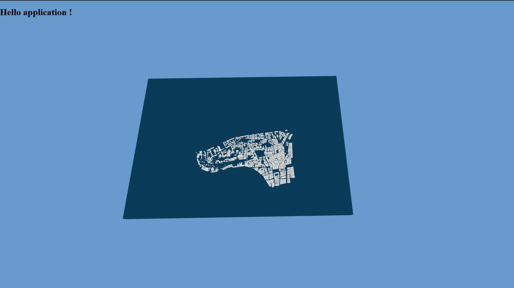
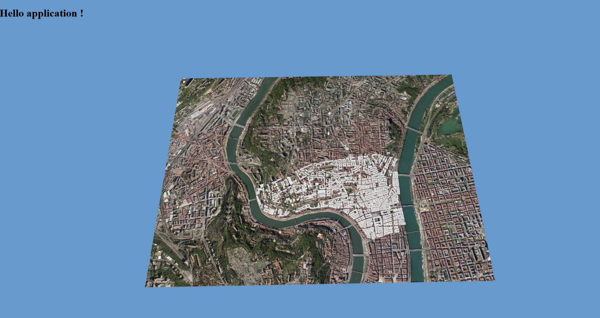
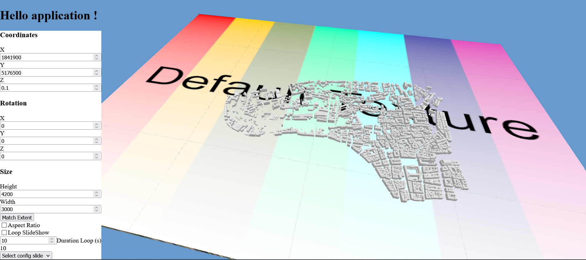

# UD-Viz-Template : a tutorial to build your UD-Viz integrated demo

Hello !
Welcome in `UD-Viz-Template` repository. This repository offers a base for create your own integrated demo using the [UD-Viz](https://github.com/VCityTeam/UD-Viz) framework and notably its three packages `npm` : [`@ud-viz/browser`](https://www.npmjs.com/package/@ud-viz/browser), [`@ud-viz/shared`](https://www.npmjs.com/package/@ud-viz/shared), [`@ud-viz/node`](https://www.npmjs.com/package/@ud-viz/node).  

## Required skills

In order to go through this tutorial you will need to be aquainted with:
- `git` (repository, branches, fork): refer to [this git gateway](https://github.com/VCityTeam/UD-SV/blob/master/Tools/ToolGit.md)
- the basics of JavaScript programming. Useful links : [MDN docs](https://developer.mozilla.org/en-US/docs/Learn/Getting_started_with_the_web/JavaScript_basics) (browser), and [W3School tutorial](https://www.w3schools.com/nodejs/nodejs_get_started.asp) (node.js). FIXME: porter ce contenu dans la [doc standard](https://github.com/VCityTeam/UD-SV/blob/master/Tools/ToolJavaScript.md).
- Make a quick survey of what [the UD-Viz framwork is about](https://github.com/VCityTeam/UD-Viz).

## Quick starting

> Prerequisites: Install npm, refer to [here](https://github.com/VCityTeam/UD-SV/blob/master/Tools/ToolNpm.md)

### `npm i`

Install the dependencies.

### `npm run debug`

Builds and runs the app in the development mode.
Open [http://localhost:8000/](http://localhost:8000/) to view it in your browser.

When changes are made the app is rebuild.

### `npm run build`

Builds the app in the production mode.

## Deriving your own UD-Viz based demo

As a reminder, this template is a base for your demo, it gives you the starting structure: configs files (Webpack, linter, CI...), executable scripts (what is in the ./bin folder), the [package.json](./package.json) (The structure of the in the form of a [monorepo](https://en.wikipedia.org/wiki/Monorepo?useskin=vector) = several packages in one). It is up to you to fill this template with your code and resources.

The first thing to do is to create your own workspace. If you want to create a new repository with git you have two ways to proceed:

### Github way

`UD-Viz-Template` is a [Github Template](https://docs.github.com/en/repositories/creating-and-managing-repositories/creating-a-repository-from-a-template) repository. You can chose this repository as base when you create your repository from Github UI.

### CLI way

- Create a new git repository e.g. `https://github.com/exampleuser/MyApp.git` (does not need to be hosted at github).

- Duplicate this git repository refer to [here](https://docs.github.com/en/repositories/creating-and-managing-repositories/duplicating-a-repository#mirroring-a-repository).


## Starting dev

You now have your own repository that takes as its base `UD-Viz-Template` and you want to start coding. This section is here to help you get started.

Reminders:
- Your app is a 3-package application, based on 3-package framework UD-Viz, respectively browser, shared and node. 
- Split-code by interpretation environment:  `browser` package is interpretable by the browser,  `node` package is interpretable by Node.js and  `shared` package is interpretable by both environments.
- The entry point of your application is the main [./package.json](./package.json). See doc [here](https://docs.npmjs.com/cli/v6/configuring-npm/package-json).
- The code is bundled with webpack. See doc [here](https://webpack.js.org/concepts/). *Quick note: if you're wondering why bundled `node` and `shared` code is only used for "testing" purposes*. 

To get an overall understanding of how your application works we will explain what the `npm run debug` command (the first command you run to start your demo) does step by step.

**Unscrambling the command**

> dotenv -e .env -- cross-env NODE_ENV=development nodemon --trace-warnings --verbose --watch ./packages/shared/src --watch ./packages/browser/src --watch ./packages/browser/style.css --watch ./packages/node/src  --delay 2500ms -e js,css,html ./bin/debug.js

- **`dotenv -e .env`**: *dotenv* package will allows to add the content in a [.env](./.env) into the *process.env* of node. See [dotenv](https://www.npmjs.com/package/dotenv), [dotenv-cli](https://www.npmjs.com/package/dotenv-cli), [process.env](https://nodejs.org/dist/latest-v8.x/docs/api/process.html#process_process_env).
- **`--`**: We add the command finisher --, which tells npm that anything added after this finisher should be added directly to the command. See [npm-tips](https://corgibytes.com/blog/2017/04/18/npm-tips/).
- **`cross-env NODE_ENV=development`**: *cross-env* package will allows to add variable in command line (*here NODE_ENV*) to *process.env*. See [cross-env](https://www.npmjs.com/package/cross-env), [process.env](https://nodejs.org/dist/latest-v8.x/docs/api/process.html#process_process_env).
- **`nodemon [--options] ./bin/debug.js `**: It's a package wich is a node tool for development. It restarts interpretation of a javascript file (*here [./bin/debug.js](./bin/debug.js)*) when file changes. See [nodemon](https://www.npmjs.com/package/nodemon).

**dive to [./bin/debug.js](./bin/debug.js)**

- exec and spawn are two functions from [*child-process-promise*](https://www.npmjs.com/package/child-process-promise) which allows to execute node script. See [Promise doc](https://developer.mozilla.org/en-US/docs/Web/JavaScript/Reference/Global_Objects/Promise).
- **`exec('npm run build-debug --prefix ./packages/browser')`**: It calls *npm run build-debug* defined in ./packages/browser/.package.json :
  - **`cross-env NODE_ENV=development webpack`**: webpack is the tool it permits to create a bundle of your code. The config is defined in *./packages/browser/webpack.config.json*. See doc [here](https://webpack.js.org/concepts/).
  - **`const child = spawn('node', ['./bin/host.js', process.env.PORT || 8000], { shell: true, });`**: Interprates [./bin/host.js](./bin/host.js) which launchs an express server. See [express](https://www.npmjs.com/package/express)

## Tutorial: Hello application !


### Install and start application

Firstly, when you first launch the application you need to remember to install the modules.
- `cd /MyApp`
- `npm i`

Then you can run the command that will build a bundle and serve your application
- `npm run debug`
- open http://localhost:8000

### Uncomment bootsrap.js

Result:


You'll get a page that says welcome and invites you to go to the file [bootstrap.js](./packages/browser/src/bootstrap.js) and uncomment the lines of code to launch your application. Once this is done the http://localhost:8000 page will refresh and your first 3D city scene is on its way.

Things to learn to understand bootstrap.js:

[`import xxx from 'xxx'`](https://developer.mozilla.org/en-US/docs/Web/JavaScript/Reference/Statements/import) is used to import modules (=code, assets ...). The notion of module is very important in Javascript I advise you to read [the MDN doc guide](https://developer.mozilla.org/en-US/docs/Web/JavaScript/Guide/Modules).

`import './xxx.css'` indicates that the .css file should be added to the application bundle. To understand web-bundling you can follow the [Getting-Started from webpack](https://webpack.js.org/guides/getting-started/)

`document` is a variable that is part of your browser's web API, it allows you to add / retrieve / delete / create ([html elements](https://developer.mozilla.org/en-US/docs/Web/API/HTMLElement)) in your [DOM](https://developer.mozilla.org/en-US/docs/Web/API/Document_object_model/Using_the_Document_Object_Model#what_is_a_dom_tree).
To see the contents of this variable go to your browser's console on the web page of your choice and type `document`. 

The `document.body` contains the [HTML body element](https://developer.mozilla.org/en-US/docs/Web/API/HTMLBodyElement) of your DOM. The `<body>` tag in your [index.html](./packages/browser/index.html).

`landingPage` is an HTML Element defined and export by [landingPage.js](./packages/browser/src/landingPage.js) 

`DEBUG` is a global variable that is set during the build of your application, it gives information about the [`mode`](https://webpack.js.org/configuration/mode/) build that was used to create the bundle.
> In DEBUG mode, a `<script>` tag is added to your DOM to allow automatic refreshes of your web page when changes are detected.  

### Add a base map

Result:


To add a map texture under the 3D buildings you will use a function available in @ud-viz/browser. Here are the steps to follow:
- Go to the [`bootstrap.js`](./).
- import the `addBaseMapLayer` function (module) by adding this line at the top of your file: `import { addBaseMapLayer } from '@ud-viz/browser/';`. (You can access it thanks to the `npm i` command you did earlier. You can find the @ud-viz package in your `nodes_modules` folder)
- Call the function after starting your application:
```js
addBaseMapLayer(
  {
    url: 'https://download.data.grandlyon.com/wms/grandlyon',
    name: 'Ortho2018_Dalle_unique_8cm_CC46',
    version: '1.3.0',
    format: 'image/jpeg',
    layer_name: 'Base_Map',
    transparent: true,
    image:
      'https://download.data.grandlyon.com/catalogue/srv/fre//resources.get?uuid=7e0bab06-ff3b-453e-9b72-e16b8f08d926&fname=ortho2018_s.png',
  },
  app.frame3DPlanar.itownsView,
  app.extent
);
```
The function takes as parameters:
- a config in the form of a [javascript object](https://developer.mozilla.org/en-US/docs/Web/JavaScript/Reference/Operators/Object_initializer)
- an `iTowns.PlanarView`. This is what creates the html element that contains the 3D scene (camera, renderer...). See [itowns doc](http://www.itowns-project.org/itowns/docs/#api/View/PlanarView).   
- an `itowns.Extent`. The geographical boundaries. See [itowns doc](http://www.itowns-project.org/itowns/docs/#api/Geographic/Extent). 
- You may notice that you don't have to create the `PlanarView` and `Extent` as they are already built into your `app` instance of the `MyApplication.js` class. You can check out MyApplication.js to get a better understanding of what is behind the launch lines.

Things to learn to understand MyApplication.js:
- MyApplication is of type class. See the [MDN related doc](https://developer.mozilla.org/en-US/docs/Web/JavaScript/Reference/Classes) 
- /!\ Be careful not to confuse this with the `class` attributes that you may come across in the [html tags](https://developer.mozilla.org/en-US/docs/Web/HTML/Global_attributes/class).


### Add your first widget

Result:


`@ud-viz/browser` provides a number of widgets that you can implement in your 3D scene.

We will implement the SlideShow widget. Here are the steps to follow:

- go to [`bootstrap.js`](./packages/browser/src/bootstrap.js)
- import the `SlideShow` class (again a module) by adding this line at the top of your file: `import { SlideShow } from '@ud-viz/browser/src/Component/Widget/Widget';`
- create your slideShow object at the end of file:
```js
const slideShow = new SlideShow(app.frame3DPlanar.itownsView, null, app.extent); // the config optional here we set at null
```
> see [SideShow.js](https://github.com/search?q=repo%3AVCityTeam%2FUD-Viz+path%3A%2FSlideShow.js+&type=code)
- call `addListeners` function of SlideShow: 
```js
slideShow.addListeners();
```
- add the `plane` object3D of slideshow in scene 3D: 
```js
app.frame3DPlanar.scene.add(slideShow.plane);
```
>see [PlaneGeometry](https://threejs.org/docs/?q=geom#api/en/geometries/PlaneGeometry) of the three.js library
- add `html` of slide of slideshow to UI:
```js
const parent = document.createElement('div');
parent.style.backgroundColor = 'white';
parent.style.width = 'fit-content';
parent.style.position = 'relative';
parent.style.zIndex = 2;
parent.appendChild(slideShow.html());

app.frame3DPlanar.appendToUI(parent);
```
- you have now a SlideShow Widget with UI in your application. You can add images with drag and drop or set up slides in your config.

### Base your application on UD-Viz examples

To learn more of what you can do with UD-Viz (to get start at least the `@ud-viz/browser` package) you can read the differents [examples](https://github.com/VCityTeam/UD-Viz/tree/master/examples) with attached [documentation](https://github.com/VCityTeam/UD-Viz/tree/master/docs/static/Devel/UD_Viz_Browser) and try to transpose them in your application.
